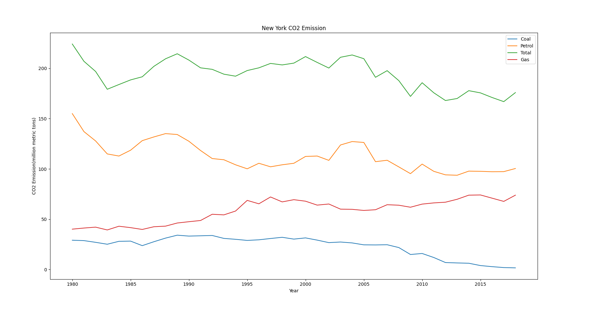

## Overview

Formula 1 is said to be the highest class of international racing for single-seater formula racing cars. F1 consist of the best drivers and the best vehicles this sport has to offer. In order for F1 vehicles to be consider the best, investors and manufacturers have to invest millions of dollars every year to achieve the best possible outcome in a formula race car. Along research, new innovations emerge and some of these innovations have a chance of being utilized in consumer-grade, mass-produced motor vehicles.
The main focus of my project is to see if advancements made in Formula 1 by different manufacturers are reflected in consumer-grade cars made by the same manufacturers. Our goal is to see if there is a correlation between Formula 1 budget cost to fuel efficieny in Formula 1 vehicles and observe if there is a trickle-down effect on to consumer-grade motor vehicles fuel efficiency and the effect this has on CO2 emissions. 
In order for us to see if F1 Research has an impact on Consumer-Grade motor vehicles, we have to examine the impact F1 research has on F1 Performance. Then we can see the standings for each year of F1 Racing and compare it to consumer-grade vehicles produced by the same manufacturers that compete in F1 and are placed within the top 5 for each year.
## Data
#### This graph shows the budget spent by different manufacture from 1999-2014.
###### Green=winner

###### Source: f1metrics        
The budget of each manufacturer has a direct correlation to success within Formula 1. The amount spent by the winning team is above the average budget cost per year, with one outlier in 2009. There is consistent data depicting a positive correlation between high budget and rate of success, thus concluding high budget equals success.

#### This table shows the Placement of different Manufacturers in F1 by Year

The Standings for each year allows us to see individual manufacturers and there performance for the year. We can use this data to show the connection between F1 Research and spending, which allows us to connect it to the consumer-grade vehicles by manufacturer. We can also see household motor vehicle manufacturers such as Mercedes-Benz, Honda, Jaguar, Ferrari, Toyota, BMW and Mclaren.

#### This is a graph of MPG of consumer-grade vehicles made by manufactures that also compete in F1 and is ordered by year.

The mile per gallon(MPG) shows how far you can travel on 1 gallon of gas on average between city and highway. Based on the MPG of consumer-grade vehicles produced by competing F1 manufacturers, the fuel effciency of those vehicles can be said: the higher the MPG the better the fuel efficiency is and vice versa. The fuel efficiency of the majority of the manufacturers were steady climbing but during 2008, every manufacturer took a massive hit to there fuel efficiency, and even completely removing Alpina from the market, but ever since then, its been steady climbing once again. Higher MPG equals Higher Fuel Efficiency Equals Lower CO2 Emissions but...

Thats not exactly the case.
#### This graph shows the Average CO2 Emissions by Sector in New York in the last 40 years.

In New York, transportation accounts for over 35% of overall CO2 emissions for the last 40 years, it is the largest contributor to CO2 emission in New York on average.  

#### This graph shows the CO2 Emissions in New York by Year.

The overall CO2 emissions in New York has declined over the last 40 years but in the recent years we have seen a gradual increase in CO2 emissions, both in the gas and petrol areas. Motor Vehicles being a top contributor to petrol CO2 emission.

#### This graph shows the Percentage of each sector in New York contributing to the overall CO2 Emission by year.

Even though petrol CO2 emissions has a miniscule increase in the recent years, transportation sector has almost doubled in the last 40 years. Why is it that fuel efficiency of consumer-grade cars increasing, and overall CO2 emissions decreasing in New York but transportation still accounting up to 50% of CO2 emission by sector?

## Conclusion
Formula 1 manufacturers account for too small of a market that is the consumer-grade vehicles. The advances made in F1 do not have enough of an impact on consumer-grade vehicles to create enough change in the CO2 emissions in New York. The advances in F1 are too costly and simply not cost-effective enough for consumer-grade vehicle manufacturers to implement. 

## Technique
The main technique I used in this project was just cleaning up data, most of the data was available but consistency of the data was a massive issue. Uniforming data from multiple sources, even the same source was difficult because of what data and how data was stored in the past. I would be cleaning the data as I progressed through the project and used alot of pd.merge, pd.concat, replace() and matplotlib.pyplot to clean and visualize all my data.  

## Citation
https://f1metrics.wordpress.com/2015/05/01/how-money-predicts-success-in-formula-1/
https://www.eia.gov/environment/emissions/state/
https://www.fia.com/sites/default/files/2021_formula_1_technical_regulations_-_iss_7_-_2020-12-16.pdf https://www.fia.com/sites/default/files/regulation/file/2013%20F1TECHNICAL%20REGULATIONS%20-%20PUBLISHED%20ON%2004.07.2013.pdf https://www.fia.com/sites/default/files/2021_formula_1_sporting_regulations_-_iss_5_-_2020-12-16.pdf
https://www.fia.com/regulation/category/761
https://www.f1technical.net/articles/19
https://www.fueleconomy.gov/feg/pdfs/guides/FEG2021.pdf 
https://ergast.com/mrd/
https://www.fueleconomy.gov/feg/download.shtml

